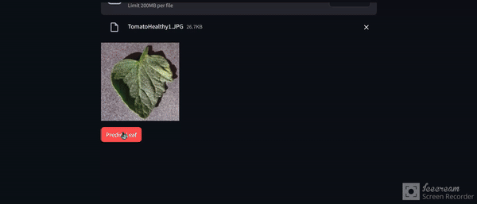

# Plant Disease Detection

This project focuses on detecting plant diseases using machine learning. The goal is to provide a reliable method to identify plant diseases from images, which can help in timely intervention and management of crops. This repository includes a Jupyter notebook for training the model, as well as instructions and resources to set up the environment and use the model.




## Table of Contents
- [Overview](#overview)
- [Dataset](#dataset)
- [Installation](#installation)
- [Usage](#usage)
- [Web Application](#web-application)
- [Results](#results)
- [License](#license)
  

## Overview
Plant diseases can have a devastating impact on agricultural productivity. This project leverages convolutional neural networks (CNNs) to classify images of leaves into various categories of diseases. The main components of the project include:
- Data preprocessing
- Model training
- Model evaluation
- Predictions on new data


## Dataset
The dataset used for this project consists of labeled images of plant leaves, categorized by disease. The dataset is divided into training, validation, and testing sets. You can download the dataset from [Kaggle's Plant Disease Dataset](https://www.kaggle.com/datasets/vipoooool/new-plant-diseases-dataset).

This dataset consists of about 87K rgb images of healthy and diseased crop leaves which is categorized into 38 different classes. The total dataset is divided into 80/20 ratio of training and validation set preserving the directory structure. A new directory containing 33 test images is created later for prediction purpose.


## Installation
To set up the environment for this project, follow these steps:

1. **Clone the repository:**
    ```bash
    git clone https://github.com/yourusername/PlantDiseaseDetection.git
    cd PlantDiseaseDetection
    ```

2. **Create a virtual environment:**
    ```bash
    python -m venv venv
    source venv/bin/activate  # On Windows use `venv\Scripts\activate`
    ```

3. **Install the required packages:**
    ```bash
    pip install -r requirements.txt
    ```

4. **Jupyter Notebook:**
    Ensure you have Jupyter installed. If not, install it using:
    ```bash
    pip install jupyter
    ```


## Usage
To train the model, you can open the Jupyter notebook and follow the instructions within:

1. **Start Jupyter Notebook:**
    ```bash
    jupyter notebook
    ```

2. **Open the notebook:**
    Open `trainPlantDisease.ipynb` and run through the cells to preprocess data, train the model, and evaluate its performance.

3. **Make Predictions:**
    Modify the notebook to include new images for prediction or use the provided scripts to load the trained model and make predictions.


## Web Application
A user-friendly web application has been built using Streamlit to allow users to easily interact with the model. Follow these steps to run the web application:

1. **Navigate to the project directory:**
    ```bash
    cd PlantDiseaseDetection
    ```

2. **Run the Streamlit app:**
    ```bash
    streamlit run mainWeb.py
    ```

3. **Access the application:**
    Open a web browser and go to `http://localhost:8501` to use the application. You can upload images of plant leaves, and the application will display the predicted disease.
   


## Results
The results section in the notebook will display the performance metrics of the trained model, including accuracy, precision, recall, and F1-score. **The model achieved an accuracy of 98%**. Visualizations such as confusion matrices and sample predictions are also included to give an intuitive understanding of the model's performance.


## License
This project is licensed under the MIT License - see the [LICENSE](LICENSE) file for details.

